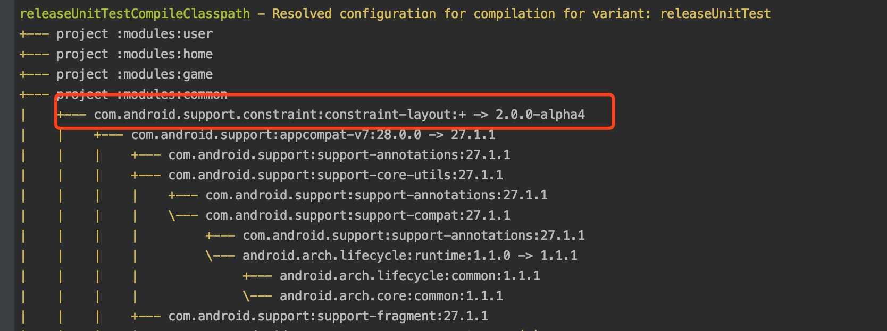

# AndroidException

## View 异常

#### 1.异常： 用ListView是在getView中出现空指针异常
**解决方法**：检查convertView.setTag(viewHolder);是否漏了。

#### 2.异常：viewHolder =  (ViewHolder) convertView.getTag();   java.lang.Integer classCastException
**解决方法**：检查一下，是否有Viewgroup 中的id 设置了setTag(),  setTag() 不能有viewgroup

#### 3. 异常：自定义控件时Multiple annotations found at this line:  - error: No resource identifier found for attribute 'autoCenterPointerInSlice' in package 
**解决方法**： 将  xmlns:custom="http://schemas.android.com/apk/res/com.yxhuang.customview" 中的com.yxhuang.customview ，换成包名

#### 4. 异常：Missing styles. Is the correct theme chosen for this layout?
Use the Theme combo box above the layout to choose a different layout, or fix the theme style references.
Failed to find style 'textViewStyle' in current theme
preview 布局界面黑掉了
**解决方法**：在preview中选择其他主题

## 数据结构异常
#### 1.异常：java.lang.NoSuchMethodError: No virtual method object() Lorg/json/JSONStringer;
**解决方法**：因为混淆的问题，只要在 proguard-project.txt 中添加保持 -keep class  org.json.**{*;} 

## 运行时异常
#### 1.异常： Android Runtime Exception font asset not found
**解决方法**
1、检查 Typeface. createFromAsset(context.getAssets() , "fonts/AndroidClockMono-Thin.ttf" ) ;
2、检查  xx.iml 文件中  <option name= "ASSETS_FOLDER_RELATIVE_PATH" value="/src/main/assets" />  是否正确

#### 2.异常： Activity class {com.android.calculator2/com.android.calculator2.Calculator} does not exist.

#### 3.异常：Failure [INSTALL_FAILED_UPDATE_INCOMPATIBLE]

## 编译异常
#### 1.异常： cannot resolve symbol Theme.AppCompat.Light.NoActionBar
**解决方法**：
Error:Execution failed for task ':OnyxAndroidSDKInternal:ndkBuild'.
> A problem occurred starting process 'command 'ndk-build.cmd''

#### 2.异常： starting process 'command 'D:\Android\sdk\ndk-bundle/ndk-build''
**解决方法**：
     file >> project structure 中设置 NDK 路径


#### 3.异常： appcompat-v7-27.1.1.aar/4d566495a5750653e386c33e52270899/res/values-v26/values-v26.xml:13:5-16:13: AAPT: No resource found that matches the given name: attr 'android:keyboardNavigationCluster’

**解决方法**： 可能是 appcompat-v7-27.1.1 的异常，改成其他版本即可，例如 'com.android.support:appcompat-v7:26.0.1'

#### 4. 问题：android java.io.IOException: No such file or directory
**解决方法**：API 23 以上需要读写文件权限，同时要去应用权限那里设置权限
问题： The application's PagerAdapter changed the adapter's contents without calling PagerAdapter#notifyDataSetChanged
解决方法:


#### 5. 问题： AGPBI: {"kind":"error","text":"Attribute \"android:translationX\" has already been defined","sources":[{"file":"/Users/yxhuang/software/gradle/gradle-3.3/caches/transforms-1/files-1.1/appcompat-v7-27.1.1.aar/4c3605d71604baf2ea370300a71a20e8/res/values/values.xml","position":{"startLine":250,"startColumn":4,"startOffset":27058,"endColumn":68,"endOffset":27122}}],"original":"","tool":"AAPT"}
**解决方法**：
先用命令 
>./gradlew app:dependencie

查看依赖树，看看是有依赖 + 的，如果是，怎很可能是整个库改变了，然后改成指定版本即可
例如:


然后将
> 'com.android.support.constraint:constraint-layout:+'

改为
> 'com.android.support.constraint:constraint-layout:1.1.2'

## Tinker 的使用异常

#### 补丁包异常
异常 

**解决方法**：
是因为 Tinker 需要检测生成的 R 文件类型，如果不是正常的类型，就会抛错

源码中的片段

```java
 if (!RESOURCE_TYPES.containsKey(resourceType)) {
    throw new AaptUtilException("Invalid resource type '<" + resourceType + ">' in '" + valuesFullFilename + "'.");
 }
```
查看是否使用错了类型

```xml
    <android.support.v7.widget.AppCompatSeekBar
        android:id="@+id/game_sb_slide_sensi"
        android:layout_width="match_parent"
        android:layout_height="@dimen/d_17"
        android:layout_centerVertical="true"
        android:layout_marginLeft="@dimen/d_36"
        android:layout_toLeftOf="@+id/game_tv_slide_sensi_value"
        android:layout_toRightOf="@+id/game_tv_slide_sensi"
        android:max="101"
        android:min="1"
        android:maxHeight="@dimen/d_2"
        android:paddingLeft="@dimen/d_9"
        android:paddingRight="@dimen/d_9"
        android:progressDrawable="@drawable/game_shape_setting_slide_sensi"
        android:splitTrack="false"
        android:thumb="@+drawable/game_ic_setting_slide_sensi"
        android:thumbOffset="6dp" />
```

中的 

```xml
android:thumb="@+drawable/game_ic_setting_slide_sensi"
```
使用 +drawable, 出错了，应该把 + 号去掉


